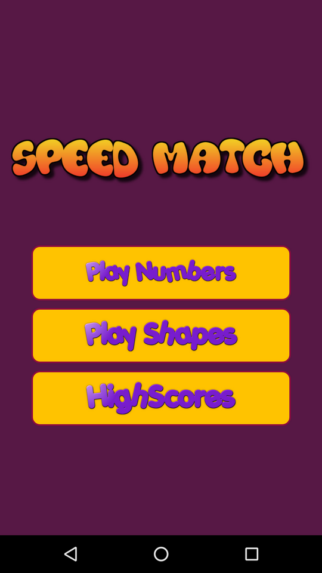
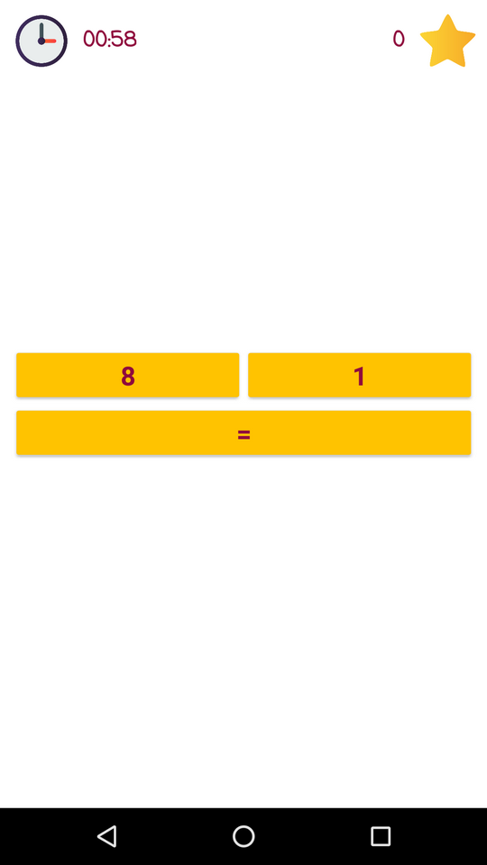
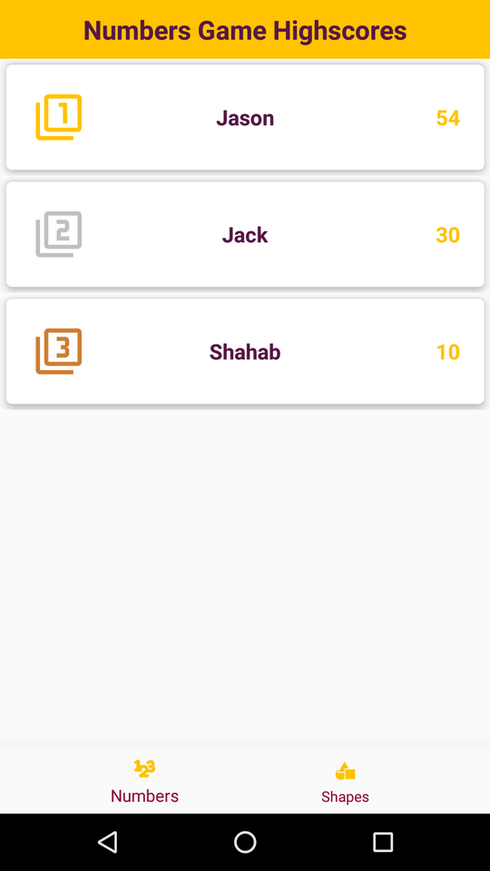
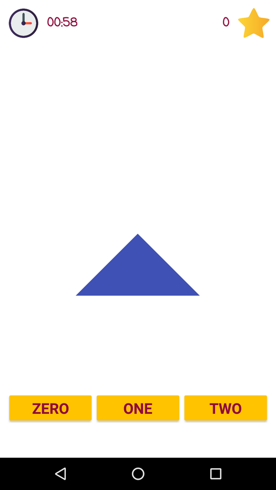

# SpeedMatch

  

SpeedMatch is a time based game where you can choose to play Numbers or shapes.

# Table of Contents
  1. [SpeedMatch](https://github.com/ShahabGT/SpeedMatch#speedmatch)
		  2. [Developed By](https://github.com/ShahabGT/SpeedMatch#developed-by)
			   3. [License](https://github.com/ShahabGT/SpeedMatch#license)

# SpeedMatch

  

in the main page you get to choose to play number or shapes or just see the highscore table,

  

in the numbers game whitin a 60 sec time limit you must choose the bigger nummber to collect more stars and reach a new highscore.

  

in shapes game you will see 2 shapes back to back and you must choose the number of diffrence (shape, color or nothing) between two shapes.
with each correct answer you'll get a new star.

  

and in the highscore page, you can see the number of players and their score, for Numbers and Shapes game individually.

# Developed By

* Shahab Azimi
 * [shahabazimi.ir](http://shahabazimi.ir) - <azimishahab@gmail.com>

# License

    Copyright 2018 Shahab Azimi

    Licensed under the Apache License, Version 2.0 (the "License");
    you may not use this file except in compliance with the License.
    You may obtain a copy of the License at

       http://www.apache.org/licenses/LICENSE-2.0

    Unless required by applicable law or agreed to in writing, software
    distributed under the License is distributed on an "AS IS" BASIS,
    WITHOUT WARRANTIES OR CONDITIONS OF ANY KIND, either express or implied.
    See the License for the specific language governing permissions and
    limitations under the License.
